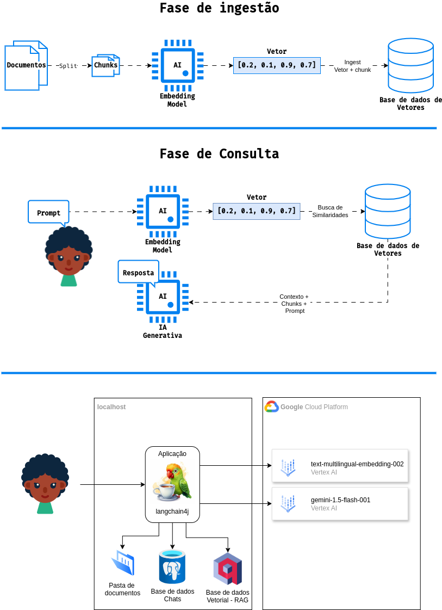

# java-langchain4j-googlevertexai-rag

Este repositório tem como objetivo demonstrar a utilização do [langchain4j](https://docs.langchain4j.dev/) para a construção de aplicações de chat com uso de LLMs (Large Language Models) comerciais em conjunto com a técnica RAG (Retrieval Augmented Generation).

## Tecnologias utilizadas

Foram utilizadas as seguintes tecnologias:

 - [Java](https://www.java.com/pt-BR/) 21
 - [Gradle](https://gradle.org/) 8.8
 - [langchain4j](https://docs.langchain4j.dev/) 0.33.0
 - [Postgres](https://www.postgresql.org/) 16.3
 - [Qdrant](https://qdrant.tech/) Vector Database
 - [Google Vertex AI](https://cloud.google.com/vertex-ai/generative-ai/docs/learn/overview?hl=pt-br) - Modelos [text-multilingual-embedding-002](https://cloud.google.com/vertex-ai/generative-ai/docs/model-reference/text-embeddings-api?hl=pt-br) e [gemini-1.5-flash-001](https://cloud.google.com/vertex-ai/generative-ai/docs/quotas?hl=pt-br)
 - [Docker](https://docs.docker.com/) e [docker compose](https://docs.docker.com/compose/)

## Representação visual da aplicação

## Funcionamento

Antes de iniciar a aplicação devemos criar os recursos necessários para a mesma através da ferramenta [docker compose](https://docs.docker.com/compose/). Serão criadas as bases de dados [postgres](https://www.postgresql.org/) e [Qdrant](https://qdrant.tech/). 

O arquivo [docker-compose.yaml](./docker-compose.yaml) está configurado para inicializar a base de dados postgres com a estrutura de tabela necessária para armazenamento dos chats através do script sql [init.sql](./postgres/init.sql).

Ao iniciar a execução da aplicação a mesma irá:
 - Instanciar a classe [PersistentChatMemoryStore](./app/src/main/java/app/PersistentChatMemoryStore.java), responsável por gerenciar o armazenamento dos chats. Esta classe implementa a interface ChatMemoryStore do framework [langchain4j](https://docs.langchain4j.dev/) que irá orquestrar as chamadas aos métodos implementados pela classe para gerenciar a persistência dos chats. 

 - Instanciar o modelo de embedding, responsável por transformar as partes dos documentos em vetores, referenciando o modelo [text-multilingual-embedding-002](https://cloud.google.com/vertex-ai/generative-ai/docs/model-reference/text-embeddings-api?hl=pt-br), disposto pelo [Google Cloud Platform](https://cloud.google.com/?hl=pt_br),através da interface EmbeddingModel e classe VertexAiEmbeddingModel do framework [langchain4j](https://docs.langchain4j.dev/) 

 - Instanciar o modelo de chat, responsável por interagir com a LLM comercial, referenciando o modelo [gemini-1.5-flash-001](https://cloud.google.com/vertex-ai/generative-ai/docs/model-reference/text-embeddings-api?hl=pt-br), disposto pelo [Google Cloud Platform](https://cloud.google.com/?hl=pt_br),através da interface ChatLanguageModel e classe VertexAiGeminiChatModel do framework [langchain4j](https://docs.langchain4j.dev/) 

 - Instanciar a classe EmbeddingStore<TextSegment> do framework [langchain4j](https://docs.langchain4j.dev/), inicializando a coleção de vetores na base de dados vetorial [Qdrant](https://qdrant.tech/), obtendo os documentos dispostos na pasta [documents](./app/src/main/resources/documents/), vetorizando as partes dos documentos e inserindo os mesmos na base de dados vetorial. A classe [ DocumentIngestor](./app/src/main/java/app/DocumentIngestor.java) utiliza classes do framework [langchain4j](https://docs.langchain4j.dev/) e classes dispostas pelo cliente [Java](https://www.java.com/pt-BR/) do [Qdrant](https://qdrant.tech/) para ingerir os documentos. Na criação da coleção do [Qdrant](https://qdrant.tech/) são utilizadas as configurações tamanho do vetor igual a 768 (conforme modelo [text-multilingual-embedding-002](https://cloud.google.com/vertex-ai/generative-ai/docs/model-reference/text-embeddings-api?hl=pt-br)) e [métrica de cálculo de similaridade](https://qdrant.tech/documentation/concepts/search/#metrics) de vetores igual a [Cosseno](https://pt.wikipedia.org/wiki/Similaridade_por_cosseno) por ser a indicada para textos.

 - Instanciar a classe CompressingQueryTransformer do framework [langchain4j](https://docs.langchain4j.dev/) referenciando o modelo de chat já instanciado. Esta classe será responsável por condensar uma determinada consulta junto com uma memória de chat em uma consulta concisa.

 - Instanciar a classe EmbeddingStoreContentRetriever do framework [langchain4j](https://docs.langchain4j.dev/) referenciando a instância da classe EmbeddingStore<TextSegment> e do modelo de embedding já citados. Esta classe será responsável por orquestrar as chamadas ao EmbeddingStore<TextSegment> para obtenção de similaridades de vetores. Foram customizadas as configurações de resultados máximos igual a 2 e score mínimo igual a 0.82.

 - Instanciar a classe DefaultRetrievalAugmentor do framework [langchain4j](https://docs.langchain4j.dev/) referenciando a instância da classe EmbeddingStore<TextSegment> e do modelo de embedding já citados. Esta classe será responsável por orquestrar orquestrar o fluxo entre os componentes básicos QueryTransformer, QueryRouter, ContentRetriever, ContentAggregator e ContentInjector. O fluxo pode ser descrito da seguinte forma:
    
    - Uma consulta é transformada usando um QueryTransformer em uma ou várias consultas.
    - Cada consulta é roteada para o ContentRetriever apropriado usando um QueryRouter. Cada ContentRetriever recupera um ou vários conteúdos usando uma consulta.
    - Todos os conteúdos recuperados por todos os ContentRetrievers usando todas as consultas são agregados (fundidos/reclassificados/filtrados/etc.) em uma lista final de conteúdos usando um ContentAggregator.
    - Por último, uma lista final de conteúdos é injetada no prompt usando um ContentInjector

 - Instanciar a classe MessageWindowChatMemory do framework [langchain4j](https://docs.langchain4j.dev/) referenciando a instância da classe PersistentChatMemoryStore. Esta classe será responsável por orquestrar as chamadas à PersistentChatMemoryStore para obter as mensagens históricas dos chats. A configuração do número máximo de mensagens históricas carregadas foi customizada para 5.

 - Instanciar a interface [Assistant](./app/src/main/java/app/Assistant.java), através da classe AiServices do framework [langchain4j](https://docs.langchain4j.dev/), referenciando as instâncias das classes DefaultRetrievalAugmentor, do modelo de chat e MessageWindowChatMemory. 

Após a inicialização da aplicação é exibida uma mensagem com todos os identificadores de chats armazenados na base de dados [Postgres](https://www.postgresql.org/).

A aplicação então solicita que o usuário informe o id do chat para continuar um chat existente ou a entrada de um novo id para iniciar um novo chat. O id deve ser um número inteiro.

Caso seja optado por continuar um chat existente o framework [langchain4j](https://docs.langchain4j.dev/) irá carregar as últimas 15 mensagens do chat e enviar os mesmos para o LLM, caso contrário irá persistir um novo chat. Após isto o framework irá solicitar a entrada de uma nova mensagem (prompt) do usuário para ser enviado ao LLM.

Após informar a mensagem o framework [langchain4j](https://docs.langchain4j.dev/) irá converter a mensagem em um vetor através do modelo [text-multilingual-embedding-002](https://cloud.google.com/vertex-ai/generative-ai/docs/model-reference/text-embeddings-api?hl=pt-br) e buscar na base de dados de vetores [Qdrant](https://qdrant.tech/) os vetores similares.

Caso sejam encontradas similaridades o framework [langchain4j](https://docs.langchain4j.dev/) irá alterar o prompt feito para incluir o texto original referente aos vetores similares, caso contrário o mesmo não irá alterar o prompt, e enviar o prompt para o LLM [gemini-1.5-flash-001](https://cloud.google.com/vertex-ai/generative-ai/docs/quotas?hl=pt-br)

Com a resposta do LLM a aplicação exibe então a mensagem enviada e a resposta da mesma.

Após isto é solicitada novamente a entrada de uma nova mensagem (prompt) do usuário para ser enviado ao LLM até que o usuário insira a mensagem sair.

## Execução

### Configurações necessárias para a execução da aplicação

http://localhost:5050/browser/